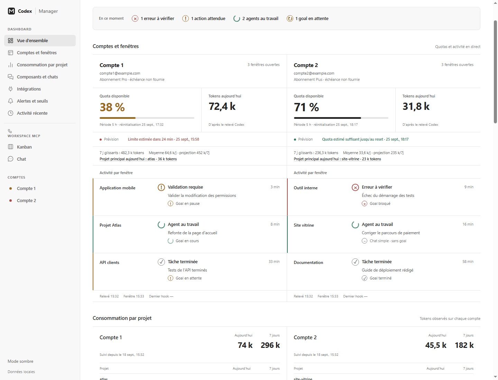

# Codex Manager

Codex Manager is a local dashboard for running multiple Codex sessions as a team. It shows what each confirmed VS Code window is doing, tracks usage across accounts and projects, and provides a shared workspace for tasks and agent messages.

## Features

- Live account, window, conversation, goal, quota, and token overview.
- Project usage, recent activity, configurable alerts, and paired Telegram notifications.
- Workspace MCP with a Kanban board, channels, agent inboxes, and a communication graph.
- Conversation search, bulk archive, duplicate review, and selected chat copying between local accounts.
- Optional Windows tray launcher and Tailscale channel sharing between two workspaces.



## Requirements

Windows, Python 3.11 or newer, Codex CLI, and the Codex VS Code extension. The backend uses the Python standard library. Node.js is only needed to build the optional VS Code presence extension or regenerate screenshots.

## Install and run

From a PowerShell terminal in this directory:

```powershell
python install_hooks.py
powershell -NoProfile -ExecutionPolicy Bypass -File scripts/install_extension.ps1
python scripts/install_workspace_mcp.py
python server.py
```

Open **http://127.0.0.1:8765/**. Review and approve the installed personal hooks with `/hooks` in the Codex CLI for **each account**, then reload existing VS Code windows and Codex sessions. Without hook approval, those events will not be delivered.

The installer detects two profiles at `%LOCALAPPDATA%\VSCode-Codex\Compte-1` and `Compte-2` by default. For other locations, create a local `config.json` as described in [Setup](docs/setup.md). Local configuration and runtime data are ignored by Git.

To explore without connecting accounts:

```powershell
python server.py --demo --port 8768
```

Open **http://127.0.0.1:8768/**. Demo data is synthetic and held in memory.

## Guides

- [Setup, profiles, hooks, and Windows startup](docs/setup.md)
- [Monitoring, usage metrics, and conversation management](docs/monitoring.md)
- [Workspace MCP, agent messaging, tasks, and Tailscale sharing](docs/workspace.md)
- [Telegram pairing, alerts, and security](docs/telegram.md)
- [Presence extension](extension/README.md)
- [Agent collaboration instructions](AGENTS.md)

## Verify

```powershell
python -m unittest discover -s tests -v
```

Codex Manager binds the dashboard to `127.0.0.1` by default. The optional federation gateway is configured separately; see [Workspace MCP](docs/workspace.md).
